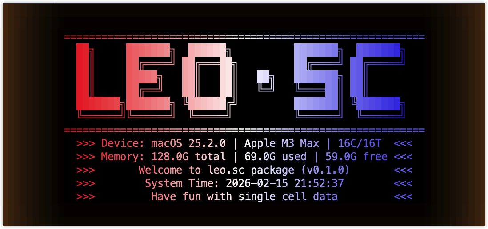

# LEO.SC

<p align="center">
  <a href="https://laleoarrow.r-universe.dev/leo.sc">
    
  </a>
  <a href="https://github.com/r-universe/laleoarrow/actions/workflows/build.yml">
    
  </a>
  <a href="https://github.com/laleoarrow/leo.sc/actions/workflows/R-CMD-check.yaml">
    
  </a>
  <a href="https://lifecycle.r-lib.org/articles/stages.html#experimental">
    
  </a>
  <a href="https://www.researchgate.net/profile/Ao-Lu-5">
    
  </a>
  <a href="https://orcid.org/0009-0001-0927-4468">
    
  </a>
  <a href="https://github.com/laleoarrow/leo.sc">
    
  </a>
</p>

<p align="center">
  
  <br>
  <em>Single cell analysis space for LEO universe</em>
</p>

### Introduction

**Layered Exploratory Omics** (LEO) is a tool specifically designed for deep analysis of genomic data. `leo.sc` focuses on single-cell analysis, providing specialized functions for data exploration and visualization. It employs a multi-layered exploratory approach to help researchers (**mostly myself**) uncover the complex biological information hidden behind their data. Combining cutting-edge statistical and computational methodologies, LEO offers a user-friendly interface and powerful data-processing capabilities, enabling users ranging from beginners to advanced to effectively explore and analyze their single-cell data.

### Development Status
**LEO is currently in the early stages of development**. We welcome feedback from developers, researchers, and users to help improve the product. Please note that some features may not be fully stable yet, and interfaces may change based on user feedback.

### Installation

You can install `leo.sc` from [r-universe](https://laleoarrow.r-universe.dev) like so:

``` r
# Enable the r-universe repository
options(repos = c(
  laleoarrow = "https://laleoarrow.r-universe.dev",
  CRAN = "https://cloud.r-project.org"
))

# Install leo.sc
install.packages("leo.sc")
```

Alternatively, you can install the development version from [GitHub](https://github.com/laleoarrow/leo.sc) with:

``` r
# install.packages("devtools")
devtools::install_github("laleoarrow/leo.sc")
```

### How to Contribute
We encourage and welcome contributions to LEO from the community. If you are interested in contributing code or documentation, please contact me by submitting a issue.

### License
LEO is proprietary software. All rights reserved. Please refer to the LICENSE file for terms and restrictions.

### Contact Information
For more information or assistance, please contact us at [Ao Lu](mailto:luao@stu.cqmu.edu.cn).

### Citation
If you use `leo.sc` in your work, please cite:

```r
citation("leo.sc")
```

```bibtex
@Manual{leo.sc,
  title = {leo.sc: Layered Exploratory Omics (LEO for single-cell analysis)},
  author = {Ao Lu},
  year = {2026},
  note = {R package version 0.1.0},
  url = {https://github.com/laleoarrow/leo.sc}
}
```

**We look forward to collaborating with researchers and developers worldwide to advance innovation and progress in genomic data analysis!**
