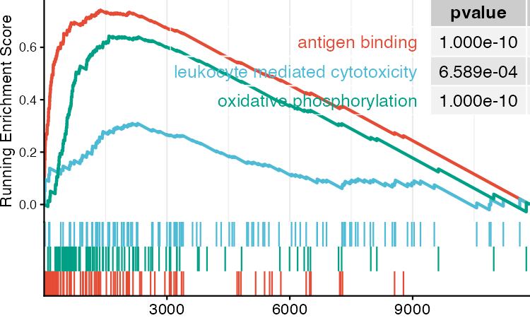

```{r setup, include=FALSE}
knitr::opts_chunk$set(collapse = TRUE, comment = "#>")
find_leo_sc_root <- function(start = getwd()) {
  cur <- normalizePath(start, winslash = "/", mustWork = TRUE)
  repeat {
    desc <- file.path(cur, "DESCRIPTION")
    if (file.exists(desc)) {
      desc_lines <- readLines(desc, warn = FALSE)
      if (any(grepl("^Package:\\s*leo\\.sc\\s*$", desc_lines))) {
        return(cur)
      }
    }
    parent <- dirname(cur)
    if (identical(parent, cur)) {
      return(NULL)
    }
    cur <- parent
  }
}

# Prefer local checkout when available; otherwise use installed package.
pkg_root <- find_leo_sc_root()
if (!is.null(pkg_root) && requireNamespace("devtools", quietly = TRUE)) {
  devtools::load_all(pkg_root, quiet = TRUE)
} else if (!requireNamespace("leo.sc", quietly = TRUE)) {
  stop("Please install leo.sc, or render from a leo.sc source checkout with devtools installed.")
}

silico_ko <- get("silico_ko", envir = asNamespace("leo.sc"), inherits = FALSE)
```

## Overview

This tutorial demonstrates the **Functional Inference Pipeline (FIP)** via `silico_ko()` from `leo.sc`.

FIP estimates gene-associated transcriptional programs by comparing cells with **low** versus **high** endogenous expression of a target gene ***g***, conceptually mimicking transcriptional changes after a perturbation knock-down — but entirely *in silico* using existing single-cell data. The function is named `silico_ko()` (SKO) for memorability, but the underlying logic is more akin to **endogenous knock-down / knock-high** contrasting rather than a true genetic knockout.

- **Dataset**: `SeuratObject::pbmc_small` (80-cell Seurat demo object, for illustration only)
- **Goal**: Identify functional gene programs associated with high expression of a target immune gene
- **Output**: Cell-type composition of high-expressors, DEG table, and enrichment results

## Method

FIP proceeds in six steps:

1. **Filter**: Exclude cells with zero target-gene expression; remove rare cell types (< `filter_cell_threshold` cells).
2. **Rank**: Rank all remaining ***g***-expressing cells (*N*) by expression of the target gene.
3. **Select *g*<sup>high</sup>**: Select the top cells (top `pct_threshold` fraction, e.g., 0.1 = 10%; or `abs_threshold` absolute count) as the **high-expression group**, preserving cell-type composition.
4. **Match *g*<sup>low</sup>**: Select an equal number of bottom cells as the **low-expression group** with matched cell-type composition to minimise lineage confounding.
5. **DEG**: Apply `Seurat::FindMarkers()` (Wilcoxon rank-sum; ***g***<sup>low</sup> as `ident.1`) to identify differentially expressed programs between groups.
6. **Enrichment**: Run `leo.basic::leo_enrich()` (ORA / GSEA against GO, KEGG, or custom backgrounds) to infer the biological functions associated with ***g***<sup>high</sup> vs ***g***<sup>low</sup>.

> **Naming note**: The function retains the `silico_ko` / SKO name for conciseness and memorability. Results should be interpreted as transcriptional correlates of high vs low endogenous expression, **not** as causal knockout effects.


## Data & Gene Setup

```{r data-setup}
data("pbmc_small", package = "SeuratObject")
srt <- pbmc_small

# Annotate clusters using canonical PBMC marker expression.
# Verified empirically from mean expression per cluster below.
# Reference: Seurat PBMC3k tutorial — https://satijalab.org/seurat/articles/pbmc3k_tutorial
#   Monocytes   : TYROBP, LST1, FCGR3A  (cluster 1 — highest TYROBP/LST1)
#   T / NK cells: CD3D, IL7R, NKG7      (cluster 0 — highest CD3D/NKG7)
#   B cells     : MS4A1                 (cluster 2 — highest MS4A1)
cluster_map <- c("0" = "T/NK cells", "1" = "CD14+ Monocytes", "2" = "B cells")
srt$cell_anno <- dplyr::recode_values(
  as.character(Seurat::Idents(srt)),
  from = names(cluster_map),
  to = unname(cluster_map)
)

candidate_genes <- c("LST1", "NKG7", "TYROBP", "IL7R", "CD3D", "MS4A1")

expr_mat <- Seurat::GetAssayData(srt, layer = "data")
cli::cli_alert_info("Successfully loaded PBMC small data ({ncol(srt)} cells, {nrow(srt)} genes).")

# Verify the annotation by checking mean expression of key markers per cluster
marker_mat <- as.matrix(expr_mat[intersect(candidate_genes, rownames(expr_mat)), ])
mean_by_cluster <- aggregate(t(marker_mat),
  by = list(cluster = srt$cell_anno), FUN = mean
)
knitr::kable(mean_by_cluster,
  digits = 2,
  caption = "Mean expression of canonical markers per annotated cell type"
)

available_genes <- intersect(candidate_genes, rownames(expr_mat))
stopifnot(length(available_genes) > 0)

gene_positive_counts <- vapply(
  available_genes,
  function(g) sum(expr_mat[g, ] > 0),
  numeric(1)
)

gene_rank <- data.frame(
  gene = names(gene_positive_counts),
  n_positive_cells = as.integer(gene_positive_counts),
  stringsAsFactors = FALSE
)
gene_rank <- gene_rank[order(gene_rank$n_positive_cells, decreasing = TRUE), ]

knitr::kable(gene_rank, caption = "Candidate immune genes ranked by positive-cell count")

gene_use <- gene_rank$gene[[1]]
gene_use
```

> **⚠️ Method accuracy note:** `pbmc_small` contains only 80 cells and is used here **purely for a reproducible, dependency-free demo**. DEG and enrichment results are statistically underpowered and should **not** be interpreted biologically. For a realistic FIP result, see the [real-world example](#real-world-example-lrrk2-in-vkh-disease) below.

## Run SKO

```{r run-sko}
res <- silico_ko(
  all = srt,
  gene = gene_use,
  sko_mode = "ko",
  cell_col = "cell_anno",
  filter_cell_threshold = 3,
  pct_threshold = 0.2,
  deg_method = "default",
  enrichment_method = "ORA",
  enrichment_bg = "GO",
  simplify = FALSE # pbmc_small is too small for reliable simplification
)

names(res)
```

## Interpret Outputs

```{r inspect-output}
length(res$high_cells)
length(res$low_cells)

head(res$cell_rato)

deg <- res$deg_results
deg <- tibble::rownames_to_column(deg, "gene")
head(deg[, c("gene", "avg_log2FC", "p_val_adj")])

if (length(res$enrichments) == 0) {
  cat("No enrichment result was returned (expected for very small demo data).\n")
} else {
  print(names(res$enrichments))
}
```

## Caveats

- `pbmc_small` is intentionally tiny and is only used here to keep the demo lightweight.
- Enrichment output can be empty (`res$enrichments` may be `list()`) and this is expected in small datasets.
- For biological interpretation, use larger datasets and review parameters such as `pct_threshold`, `filter_cell_threshold`, and the enrichment background.

## Real-World Example: LRRK2 in VKH Disease

The demo above uses the minimal `pbmc_small` dataset (80 cells) where FIP
cannot produce meaningful enrichment. Below we show a **real-world FIP result**
from a Vogt–Koyanagi–Harada (VKH) disease study, applying `silico_ko()` to
**LRRK2** (a GWAS-prioritised gene) in a scRNA-seq cohort of ~50 000 PBMCs.

### Cell-type composition of ***g***<sup>high</sup>

The ***g***<sup>high</sup> group (top 10% of LRRK2-expressing cells) was
dominated by **CD14+ classical monocytes** (84.7%) and **FCGR3A+ non-classical
monocytes** (13.4%). FIP's cell-type matching ensures the ***g***<sup>low</sup>
group has the **same composition** — so any DEGs reflect LRRK2 expression
variation *within* these lineages, not cell-type differences.

### GSEA enrichment (GO)

FIP identified 2 826 up-regulated and 5 459 down-regulated DEGs
(FDR < 0.05) between LRRK2<sup>high</sup> and LRRK2<sup>low</sup> groups,
yielding **136 significant GO terms** via GSEA. Three representative pathways
are shown below:

```{r lrrk2-gsea-plot, echo=FALSE, out.width="100%", fig.cap="GSEA enrichment plot for LRRK2-high vs LRRK2-low contrast (GO terms). Top enriched pathways include antigen binding, oxidative phosphorylation, and leukocyte mediated cytotoxicity — consistent with LRRK2's established roles in innate immune signalling and mitochondrial function."}

```

The GSEA plot was generated with `enrichplot::gseaplot2()`:

```r
# Reproduce using a completed FIP result:
library(enrichplot)
p <- gseaplot2(
  res$enrichments$GSEA_GO,
  color    = ggsci::pal_npg("nrc")(3),
  geneSetID = c("GO:0003823", "GO:0006119", "GO:0001909"),
  subplots  = 1:2,
  pvalue_table = TRUE
)
```

> **Key insight**: LRRK2 is a well-known Parkinson's disease gene, but FIP
> reveals its transcriptional impact in **immune cells** — antigen binding,
> oxidative phosphorylation, and cytotoxicity — aligning with emerging
> evidence for LRRK2 in innate immune regulation and autoimmune disease.
